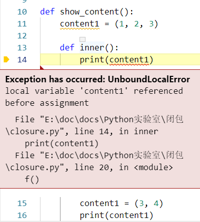

# Python实验室「闭包」

## 前言

闭包(Closure)这个词我们在探究装饰器的时候曾经提到过，它也是实现装饰器的基础。闭包提供了一种有效控制变量访问的方式，仅有有限的函数可以访问闭包变量。

闭包不是Python语言独有的特性，在C++、Java、Javascript、Go等多种编程语言中都有实现，占有重要地位，例如，在Javascript中，闭包是实现私有变量的重要方式。本文着重于闭包在Python中的实现及应用，但了解闭包的原理对于学习其他语言中的闭包也非常有助益。

## 探究
从字面上，我们可能难以理解闭包的概念，让我们从一个简单的例子开始：
```python
def say_hello():
    var_hello = 'hello'
    def inner():
        print(var_hello)
    return inner

f = say_hello()
f()
```
运行结果：  
hello

这里我们定义了一个无参函数say_hello，内部定义了一个变量字符串变量var_hello，同时定义了一个内部无参函数inner来打印变量var_hello的值，函数inner最终作为函数say_hello的返回值。

使用时我们将函数say_hello的返回值赋给f，调用f，打印出"hello"。这里的f其实是对函数inner的一个引用。

这里有一点需要留意，字符串变量var_hello是函数say_hello的局部变量，局部变量在函数执行完退出时生命周期已结束，应当会被析构掉，这里也就是f = say_hello()执行结束时。f()在执行时需要访问变量var_hello，但此时变量var_hello已经不存在，所以应该抛出一个错误。

但实际情况是，函数得以正确执行，并得到了正确的结果，也即局部变量var_hello在函数f = say_hello()执行结束，f()执行时依然能访问到，它的生命周期得到了延长，这其实就是闭包所展现的形式。

总结闭包实现的几个特征：
- 存在嵌套函数，闭包函数（外层函数）和返回函数（内层函数）；
- 存在局部变量定义于闭包函数中，在返回函数中使用；

从效果来看，闭包延长了闭包函数中定义的局部变量的生命周期，使其在返回函数中依然能访问到。但闭包的行为是否打破了函数作用域的规则呢？又是怎么实现的呢？我们再进一步探究一下。

在执行f = say_hello()后，f是函数inner的一个引用，其实际已包含了一个闭包，闭包中包含需要被用到的局部变量var_hello，是不是这样呢？我们分析一下函数f：  
\>>>f.\_\_code\_\_.co_freevars  
运行结果：('var_hello',)  
\>>>f.\_\_closure\_\_[0].cell_contents  
运行结果：'hello'  
由以上可见，闭包函数中的局部变量看起来被拷贝到了返回函数中，所以返回函数可以找到该变量并使用。闭包中保存的这些变量称为自由变量(free variables)，变量的名称保存于f.\_\_code\_\_.co_freevars，变量的值对应保存于f.\_\_closure\_\_中。

这里有个疑问？闭包中的自由变量是引用了闭包函数中的原始变量还是拷贝了一份新的？我们分别以列表和元组来尝试一下：

```python
def show_content():
    content = [1, 2, 3]
    print('Id of local list: %s' % id(content))

    def inner():
        print(content)
    return inner

f = show_content()
print('Id of free variable: %s' % 
        id(f.__closure__[0].cell_contents))
```
运行结果：  
Id of local list: 2145867663880  
Id of free variable: 2145867663880  
从运行结果看出，函数f的闭包中存在对闭包函数中局部变量列表content的引用。

```python
def show_content():
    content = (1, 2, 3)
    print('Id of local tuple: %s' % id(content))

    def inner():
        print(content)
    return inner

f = show_content()
print('Id of free variable: %s' % 
        id(f.__closure__[0].cell_contents))
```
运行结果：
Id of tuple: 1872952516896  
Id of free variable: 1872952516896  
从运行结果看出：函数f的闭包中存在对闭包函数中局部变量元组content的引用。

因此，**闭包中保存的是闭包函数中局部变量（包括[可变变量与不变变量](https://www.toutiao.com/i6717525334629024263/)）的引用**。

如果闭包函数中存在多个局部变量，闭包中会包含所有的变量呢，还是仅仅包含返回函数中会用到的变量呢？
```python
def show_content():
    content1 = (1, 2, 3)
    content2 = 'hello world'

    def inner():
        print(content1)
    return inner

f = show_content()
print('Free vars:')
print(f.__code__.co_freevars)
```
运行结果：  
Free vars:  
('content1',)  
从结果可以看出：**闭包中仅保存返回函数中会用到的局部变量**。

如果我们在返回函数中修改闭包所绑定值会如何呢？
```python
def show_content():
    content1 = (1, 2, 3)

    def inner():
        print(content1)
        content1 = (3, 4)
        print(content1)
    return inner

f = show_content()
f()
```
运行出错：  
  
出错信息提示我们在局部变量content1赋值前使用了变量。但是我们在闭包中实际存在变量content1的呀？其实Python解析器在遇到赋值语句时，认定为在返回函数作用域中又定义了一个同名局部变量，该变量将覆盖闭包中的自由变量。而该局部变量的定义发生在使用之后，因此出现此错误。

要明确地告诉解析器，我们使用的是闭包中绑定的自由变量，我们需要使用**'nonlocal'**关键字：

```python
def show_content():
    content1 = (1, 2, 3)

    def inner():
        nonlocal content1
        print(content1)
        content1 = (3, 4)
        print(content1)
    return inner

f = show_content()
f()
```
运行结果：  
(1, 2, 3)  
(3, 4)  
用nonlocal关键字声明变量后，函数inner内就不会定义新的变量，对变量的修改都会更新到闭包绑定的自由变量上。

请大家思考下面代码运行的如何：
```python
def show_content():
    content = [1, 2, 3]

    def inner():
        nonlocal content
        content.append(5)
        print(content)
    return inner

f1 = show_content()
f1()
f2 = show_content()
f2()
```
运行结果：  
[1, 2, 3, 5]  
[1, 2, 3, 5]  
从结果可以看出，两个函数实例f1与f2中闭包引用的变量是相互独立的，一个变量值的修改不会影响到另一个。两次函数show_content的调用分配了两个局部变量content分别绑定在两个闭包中。这里扩展一下，有没有办法使得两个闭包共享同一个变量呢？
```python
def get_content():
    content = [1, 2]
    def show_content():
        nonlocal content

        def inner():
            nonlocal content
            print(content)
            content.append(5)
            print(content)
        return inner
    return show_content

f = get_content()
f1 = f()
f1()
f2 = f()
f2()
```
运行结果：  
[1, 2]  
[1, 2, 5]  
[1, 2, 5]  
[1, 2, 5, 5]  
这里主要是增加了一层函数，一次定义闭包变量，多次使用，这里不作过多解释，有兴趣的小伙伴可以自己进一步探索。

如果您觉得此文对您有帮助，请分享给更多的人，并点击右上角「**关注**」按钮，了解更多博文更新。


