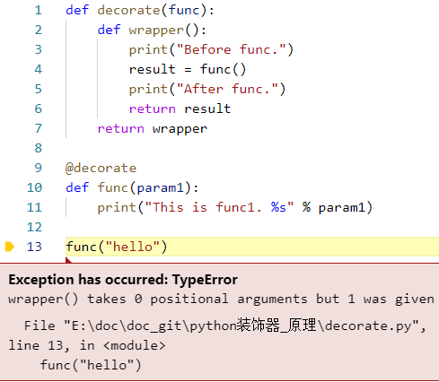

# Python实验室-函数装饰器

### 前言
在Python代码库中我们经常能看到`@staticmethod`、`@classmethod`这样的标签写在函数或类的上方。这些标签都有一个共同的特征，有一个 **'@'** 在最前面，**'@'** 就是我们今天的主要研究对象——装饰器(Decorator)[ [Python Wiki](https://wiki.python.org/moin/PythonDecorators#What_is_a_Decorator) ]. 在了解装饰器之前，符号'@' 显得神秘而强大，不了解这样一款python利器，略显可惜。
<!--more-->

### 简介
装饰器是Python在2.4版本引入的一个语法糖，采用了Decorator设计模式的思想，动态增强一个函数的功能而不需要改变被增强函数的实现，被增强函数的实现者可以专注于他的业务逻辑而无需关注增强的具体细节。常见的案例是给函数增加运行时间统计的功能，在业务函数运行前记录当前时间，在业务函数执行后计算运行时间。  

Java中也有个类似功能-注解(Annotation)，但是实现方式不一样。Python中的装饰器更多是增强一个函数的功能，被装饰的函数经过装饰后本身已经携带装饰器的实现；Java中的注解在于给类添加动态属性，需要额外的逻辑读取这些属性再进行相应地处理。

### 探索

#### 无参装饰器修饰无参函数
让我们从一个最简单的例子开始：
```python
def decorate(func):
    def wrapper():
        print("Before func.")
        result = func()
        print("After func.")
        return result
    return wrapper
```
如上便定义了一个最简单的装饰器`decorate`, 它的功能仅仅是在被修饰函数调用前后分别打印两个字符串。我们先不要研究其实现，先实际操作试试。

在使用装饰器前，我们先定义一个简单的函数：
```python
def func():
    print("This is func.")

func()
```
这个函数的功能非常简单，调用时在控制台打印字符串"This is func."。
在函数上应用装饰器：
```python
@decorate
def func():
    print("This is func.")

func()
```

此时控制台输出结果如下：  
Before func.  
This is func.  
After func.  

结果表明，装饰器已成功地在函数前后加入了新的功能，而函数func本身并没有什么显著的修改，用户并不会意识到被装饰函数在定义实现和使用上有什么差别。  
为什么会有这样的结果？我们先重新仔细看一下装饰器函数的实现细节：
```python
def decorate(func):
    def wrapper():
        print("Before func.")
        result = func()
        print("After func.")
        return result
    return wrapper
```
从装饰器的实现可以看出，在装饰器函数decorate内部定义了另外一个函数wrapper, 并且此函数作为装饰器函数decorate的结果被返回。注意：装饰器返回的结果是一个函数，因此可以被再次调用。
要理解装饰器，我们首先需要知道Python解析器是如何处理'@'符号的：
```python
@decorate
def func():
    print("This is func.")
```
在模块加载时，解析器会对@进行处理，额外增加一行代码，如下：
```python
def func():
    print("This is func.")

func = decorate(func)
```
函数func = decorate(func) 是在模块加载时执行，得到 func = wrapper, 因此，函数func的实际实现已被替换为wrapper的实现。
当我们调用func()，实际调用的是wrapper()，先打印"Before func."，再执行原来func()，最后打印"After func."，至此我们得到如上结果。

装饰器可以一次定义多次使用：
```python
@decorate
def func1():
    print("This is func1.")

@decorate
def func2():
    print("This is func2.")

func1()
func2()
```
运行后输出结果：

Before func.  
This is func1.  
After func.  
Before func.  
This is func2.  
After func.  

#### 无参装饰器修饰带参函数
不知道大家注意到没有，上面我们的装饰器修饰的函数没有参数，可以正确运行，如果用我们的装饰器修饰一个带参函数会怎么样呢？

  
Python语法解析器提示wrapper不需要参数，但是我们传递了一个参数。这里同时也暴露了，我们实际上调用的是wrapper函数。

知道了原因，我们可以修改wrapper函数，使其和被修饰函数func拥有同样的参数，并将参数传递给func：
```python
def decorate(func):
    def wrapper(param1):
        print("Before func.")
        result = func(param1)
        print("After func.")
        return result
    return wrapper

@decorate
def func(param1):
    print("This is func1. %s" param1)

func("hello")
```
此时运行正确，得到了期望的结果：  
Before func.  
This is func1. hello  
After func.  

我们来整理一下装饰器修饰带参函数的情况：  
调用`func('hello')`等价于`wrapper('hello')`的结果，因此，过程可以理解为：

func = decorate(func)  
func('hello') = decorate(func)('hello')

#### 带参装饰器修饰无参函数
装饰器本身也是一个函数，因此，它自身也可以携带参数:  
```python
@decorate("I am a decorator:")
def func():
    print("This is func." )

func()
```
这个时候装饰器修饰的结果应该等价于： 
func = decorate(dec_param)(func)()  
可以想象，装饰器的定义应该包括三层函数：
- 以装饰器参数为参数的函数，作为整个装饰器运行时环境，此环境以闭包的形式保存传入装饰器的参数
- 以修饰函数为参数，以闭包形式保存修饰函数
- 以修饰函数参数为参数的函数，定义装饰器修饰后的完整功能

```python
def decorate(dec_param1):
    def wrapper(func):
        def inner():
            print("%s Before func." % dec_param1)
            result = func()
            print("%s After func." % dec_param1)
            return result
        return inner
    return wrapper
```
上面是带参修饰器修饰无参函数的实现，decorate，wrapper函数提供的参数最终都在inner函数中使用，函数inner的实现将替换原来的func函数。

#### 带参装饰器修饰带参函数
了解了带参装饰器修饰无参函数，我们会很自然联想到带参装饰器修饰带参函数了。
```python
def decorate(dec_param):
    def wrapper(func):
        def inner(func_param):
            print("%s Before func." % dec_param)
            result = func(func_param)
            print("%s After func." % dec_param)
            return result
        return inner
    return wrapper

@decorate("I am a decorator:")
def func(func_param):
    print("This is func. %s" % func_param)

func('hello')
```
运行结果为：  
I am a decorator: Before func.  
This is func. hello  
I am a decorator: After func.  

基于前面几种情形的分析，我们可以很容易得到等效表达式为：
func = decorate(dec_param)(func)(func_param)
即，最终我们调用`func('hello')`实际调用的`decorate('I am a decorate')(func)('hello')`的结果。

#### 装饰器叠加
经过装饰器的修饰的结果依然是个函数，因此，我们可以进一步对此结果进行修饰，也就是装饰器的叠加使用。

```python
def decorate1(dec_param1):
    def wrapper(func):
        def inner(func_param):
            print("Decorate 1 start: %s" % dec_param1)
            result = func(func_param)
            print("Decorate 1 end: %s" % dec_param1)
            return result
        return inner
    return wrapper

def decorate2(dec_param2):
    def wrapper(func):
        def inner(func_param):
            print("Decorate 2 start: %s" % dec_param2)
            result = func(func_param)
            print("Decorate 2 end: %s" % dec_param2)
            return result
        return inner
    return wrapper

@decorate2('hello')
@decorate1("world")
def func(func_param):
    print("Func executed:%s" % func_param)

func('test')
```
如果大家前面的知识已经完全掌握，应该能得出这种情况的等效结果，注意越靠近函数的装饰器越早执行，也就是函数func先经过decorate1修饰，再经过decorate2修饰。

等效结果为：
func = decorate2(dec_param2)(decorate1(dec_param1)(func))
func('test') => decorate2('hello')(decorate1('world')(func))('test')

运行结果为：  
Decorate 2 start: hello  
Decorate 1 start: world  
Func executed:test  
Decorate 1 end: world  
Decorate 2 end: hello  

至此，我们已解开了函数装饰器的神秘面纱，装饰器借助一个'@'符号隐式实现了上述过程。看起来装饰器的各种情形都已经分析过，是不是我们已经完全掌握了装饰器的秘密？等等，对象也可以表现为函数的行为 - 可调用对象，装饰器在对象上也可以发挥一技之长，具体内容下一篇文章我们再进行分析。

P.S.

1. 如果装饰器希望运用在不确定参数个数的函数上，并且不太关注函数参数本身的内容，我们可以定义函数为inner(*args, **kwargs)的形式，对参数进行打包和解包，这样，任何函数都可以被该装饰器修饰。
2. 调试过程中可能会暴露装饰器替换函数的信息，如果想更好地隐藏此类信息，可以借助于库functools，注意装饰器@wraps必须应用于最后返回的函数上。

    ```python
    from functools import wraps

    def decorate(dec_param1):
        def wrapper(func):
            @wraps(func)
            def inner(func_param):
                print("%s Before func." % dec_param1)
                result = func(func_param)
                print("%s After func." % dec_param1)
                return result
            return inner
        return wrapper

    @decorate("I am a decorator:")
    def func(func_param):
        print("This is func. %s" % func_param)

    func('hello')
    print(func.__name__)
    ```